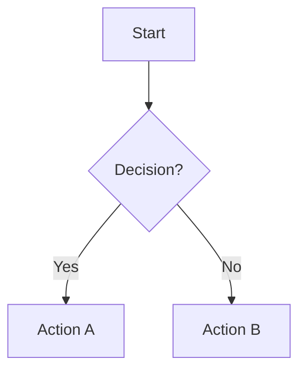
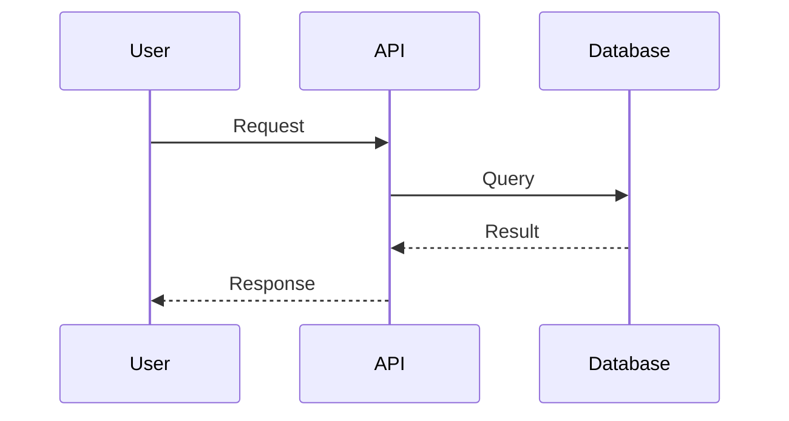
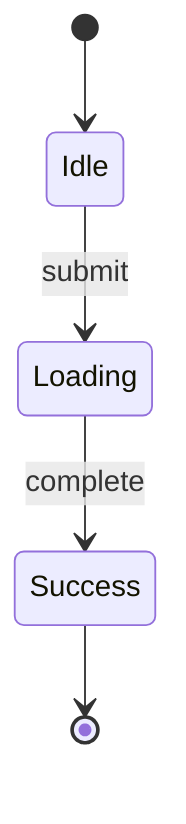
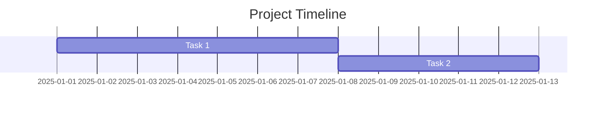

# Diagram Generator Skill

Unified skill to generate diagrams in two formats:
- ASCII diagrams (text-based, universal, great for Slack/comments)
- Mermaid diagrams (rendered in GitHub, Notion, Confluence, Obsidian)

## Format Selection

### Auto-Detection Rules

| User mentions | Selected Format |
|---------------|-----------------|
| `mermaid`, `gantt`, `sequence`, `state`, `c4`, `flowchart`, `ERD`, `diagram` | **Mermaid** |
| `ascii`, `text`, `monospace`, `console`, `slack`, `comment` | **ASCII** |
| Ambiguous or unspecified | Default to **Mermaid** |

### Explicit Format Parameter

User can specify format directly:
- "Vẽ Mermaid flowchart cho login flow"
- "ASCII diagram cho system architecture"
- "Tạo sequence diagram" → defaults to Mermaid

---

## Format 1: ASCII Diagrams

**Best for**: Slack, GitHub comments, code comments, email, plain text environments.

### Building Blocks

```
Box Characters:
┌ ─ ┐  Top corners & horizontal
│   │  Vertical sides
└ ─ ┘  Bottom corners

╭ ─ ╮  Rounded corners
╰ ─ ╯

╔ ═ ╗  Double border (emphasis)
╚ ═ ╝

Arrows:
→ ← ↑ ↓  Directional
↔ ↕      Bidirectional
⇒ ⇐      Bold

Connectors:
├ ┤ ┬ ┴  T-junctions
┼        Cross

Symbols:
✓ ✗  Check/X
★ ☆  Star
● ○  Circle
```

### Example: Simple Flow

```
┌─────────┐     ┌──────────┐     ┌─────────┐
│  Start  │ ──→ │ Process  │ ──→ │   End   │
└─────────┘     └──────────┘     └─────────┘
```

### Example: Decision Tree

```
       ┌─────────┐
       │  Valid? │
       └────┬────┘
         ┌──┴──┐
      Yes│     │No
         ↓     ↓
    ┌────────┐ ┌────────┐
    │  Save  │ │ Error  │
    └────────┘ └────────┘
```

### Example: System Architecture

```
┌──────────────┐
│   Frontend   │  (React)
└──────┬───────┘
       │ HTTPS
       ↓
┌──────────────┐
│   Backend    │  (Node.js)
└───┬──────┬───┘
    │      │
    ↓      ↓
┌─────────┐ ┌──────────┐
│   DB    │ │  Cache   │
│(Postgres)│ │  (Redis) │
└─────────┘ └──────────┘
```

### ASCII Tips
- Use consistent spacing between boxes
- Label arrows with annotations
- Keep boxes aligned vertically/horizontally
- Maximum ~80 chars width for readability

---

## Format 2: Mermaid Diagrams

**Best for**: GitHub, Notion, Confluence, GitLab, Obsidian - anywhere Mermaid renders.

### Supported Diagram Types

| Type | Syntax Start | Use Case |
|------|--------------|----------|
| Flowchart | `flowchart TD` | Processes, user flows |
| Sequence | `sequenceDiagram` | API interactions, service calls |
| State | `stateDiagram-v2` | Object lifecycles, statuses |
| User Journey | `journey` | Experience mapping with sentiment |
| C4 | `C4Context` | System architecture |
| Gantt | `gantt` | Project timelines, roadmaps |
| ERD | `erDiagram` | Database schemas |

### Quick Examples

**Flowchart:**


**Sequence Diagram:**


**State Diagram:**


**Gantt Chart:**


### Mermaid Optimization Rules
- Keep labels concise (2-5 words max)
- Limit complexity (<15 nodes per diagram)
- Use `dateFormat YYYY-MM-DD` for Gantt
- Use `after [task_id]` for dependencies
- Escape special characters with quotes

### Reference Files
- `references/syntax-reference.md` - Complete syntax for all types
- `references/optimization-rules.md` - Rendering and styling guidelines
- `references/examples.md` - Practice exercises and patterns

---

## Process Steps

1. **Understand request** - What is being visualized? Flow, architecture, timeline?
2. **Select format** - Use auto-detection or explicit user preference (defaults to Mermaid)
3. **Gather inputs**:
   - Description of diagram
   - Nodes/components to include
   - Relationships/flows between them
4. **Generate diagram** - Apply format-specific rules
5. **Validate output**:
   - ASCII: Aligned, readable monospace
   - Mermaid: Valid syntax, renders correctly
6. **Deliver** - Include in response or save to file

## Quality Gates

- Format matches user preference or auto-selection
- All nodes/components from request are included
- Relationships/flows are correctly represented
- Diagram is readable and not overcrowded
- For Mermaid: Syntax is valid and follows optimization rules
- For ASCII: Proper alignment and box drawing characters

## Related Skills

- `confluence-publishing`: Publish Mermaid/ASCII diagrams to Confluence
- `ui-design-guide`: Design guidelines for visual consistency
